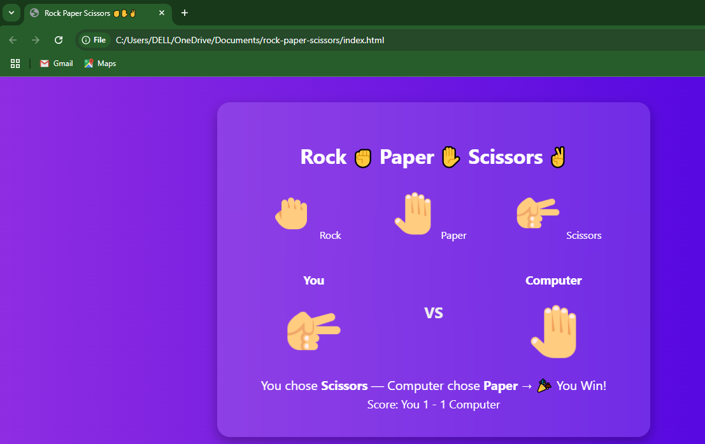
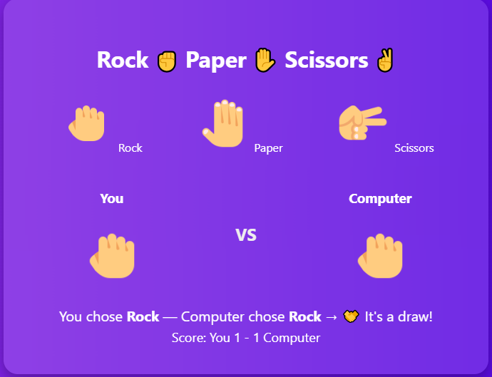
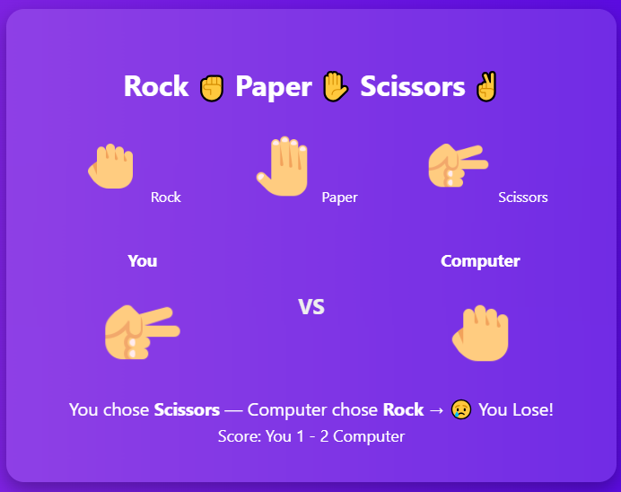

# rock_paper_scissors

# ✊ Rock Paper Scissors Game ✋✌️

A fun and interactive Rock-Paper-Scissors game built using **HTML**, **CSS**, and **JavaScript**. You play against the computer — first to outsmart the other wins!

WON:

---

## 🚀 Features

- Smooth hand gesture animations 🎮
- Live score tracking 🔢
- Responsive and stylish UI 💅
- Icon-based moves for a modern look 🤘

---

## 🕹️ How to Play

1. Choose **Rock**, **Paper**, or **Scissors**.
2. Watch the computer make its move.
3. See the result and keep an eye on the score!

---

## 🛠️ Tech Stack

- **HTML** – Structure
- **CSS** – Styling and animations
- **JavaScript** – Game logic and interactions

---

## 📷 Screenshot

DRAW:

LOST:

---

## 📁 Project Structure
rock-paper-scissors/
├── index.html
├── style.css
├── script.js
└── README.md

